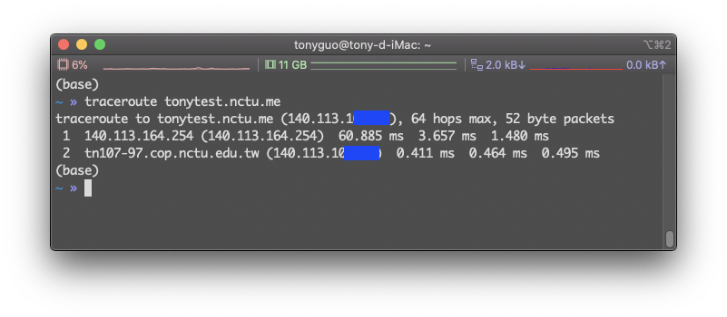
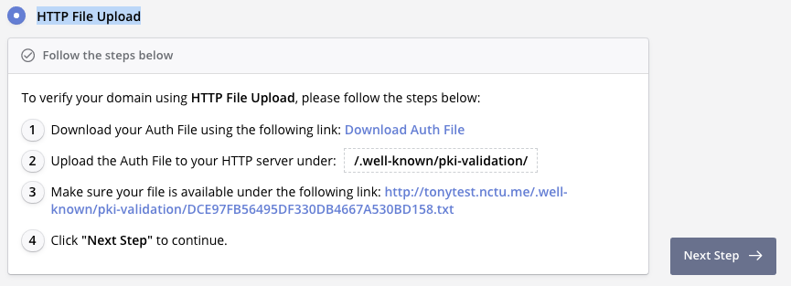

# remote_server_setup

```shell=
git clone https://github.com/Intelligent-Systems-Lab/remote_server_setup.git
```

## STEP1

[Install GPU driver](https://medium.com/codeda/ubuntu-nvidia-driver-%E5%AE%89%E8%A3%9D-38a47157663b) 

:::warning 

CUDA 10.0 requires 410.x or higher. 

:::

We use version 410.78

## STEP2

[Download cuda10 &cudnn](https://drive.google.com/drive/folders/1jdUGxx3DKJoxyMkYHzLAiBVpPalycrfa?usp=sharing)

## STEP3

[Install JupyterHub and JupyterLab from the ground up](https://jupyterhub.readthedocs.io/en/stable/installation-guide-hard.html)

install [jupyterhub](https://jupyter.org/hub)

```shell=
sudo apt update && sudo apt -y upgrade

sudo apt-get -y install python3 python3-venv
sudo python3 -m venv /opt/jupyterhub/
sudo /opt/jupyterhub/bin/python3 -m pip install -r remote_server_setup/requirements.txt

sudo apt update
sudo apt -y install curl dirmngr apt-transport-https lsb-release ca-certificates
curl -sL https://deb.nodesource.com/setup_12.x | sudo bash
sudo apt-get install -y nodejs
sudo npm install -g npm
sudo npm install -g configurable-http-proxy

node -v
npm -v
```
### configuration file
```shell=
sudo mkdir -p /opt/jupyterhub/etc/jupyterhub/
cd /opt/jupyterhub/etc/jupyterhub/

sudo /opt/jupyterhub/bin/jupyterhub --generate-config
```

change:
1. `#c.JupyterHub.default_url = ''` > `c.JupyterHub.default_url = '/lab'`
2. `#c.JupyterHub.port = 8000` > `c.JupyterHub.port = 443`

### Setup Systemd service

```shell=
sudo mkdir -p /opt/jupyterhub/etc/systemd

sudo nano /opt/jupyterhub/etc/systemd/jupyterhub.service
```
Paste these:
```shell=
[Unit]
Description=JupyterHub
After=syslog.target network.target

[Service]
User=root
Environment="PATH=/bin:/usr/local/sbin:/usr/local/bin:/usr/sbin:/usr/bin:/opt/jupyterhub/bin"
ExecStart=/opt/jupyterhub/bin/jupyterhub -f /opt/jupyterhub/etc/jupyterhub/jupyterhub_config.py

[Install]
WantedBy=multi-user.target
```
`control+o` > `y` > `control+x`

```shell=
sudo ln -s /opt/jupyterhub/etc/systemd/jupyterhub.service /etc/systemd/system/jupyterhub.service
sudo systemctl daemon-reload
sudo systemctl enable jupyterhub.service
sudo systemctl start jupyterhub.service

#to stop service
sudo systemctl stop jupyterhub.service
```

Now, JupyterHub is done.

### Free ssl certificate
what we need:
1. A domin name
2. Certificate

First, go to [NCTU ME](https://nctu.me/) to get a free domin name and set ip to your machine's ip.

You can traceroute to check it.
```shell=
traceroute tonytest.nctu.me
```



Second, go to [SSL For Free](https://www.sslforfree.com/) and registe an account.

`New Certificate` > `Domains` > [enter your domin] > `Next` > `HTTP File Upload`



This mean that the verfier will go to your machine to check the Auth file whether under your HOME directory by http(port 80).

So, launch a temperately server make verfier accessable.

```shell=
sudo python3 -m http.server 80
```

Download the Auth file and copy it to machine's HOME directory.
 
`Next Step` > `Verify Domain` > `Success` > `Download Certificate` 

Copy Certificate(.crt & .key) to your machine.

Last, add to file

nano /opt/jupyterhub/etc/jupyterhub/jupyterhub_config.py

change:
1. `#c.JupyterHub.ssl_cert = ''` > `c.JupyterHub.ssl_cert = 'DIR TO certificate.crt'`
2. `#c.JupyterHub.ssl_key = ''` > `c.JupyterHub.ssl_key = 'DIR TO private.key`

Restart jupyterhub server

```shell=
sudo systemctl restart jupyterhub.service
```

DONE